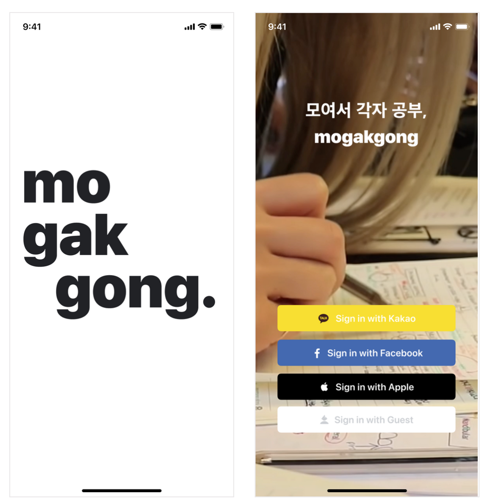
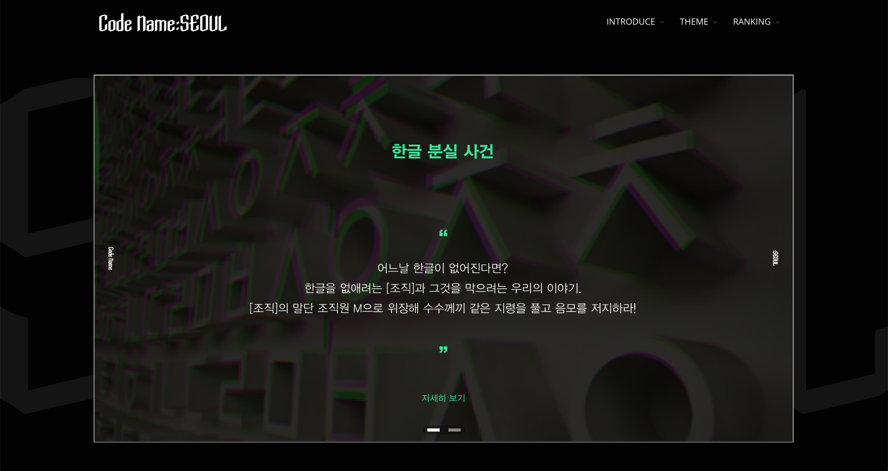
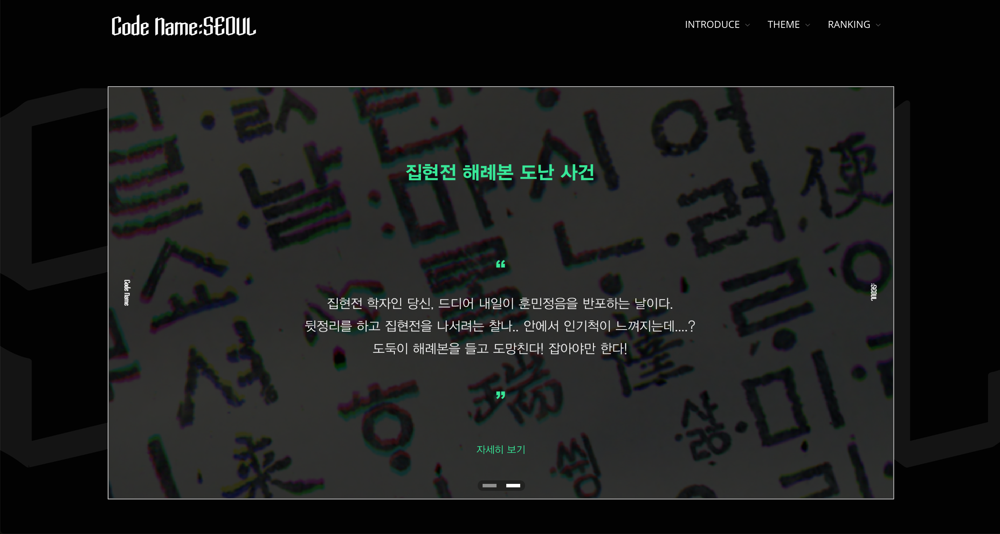

# 김선재

> _구버전_
> ### 팀원들과 서비스를 만드는 것을 좋아하고, 자유로운 토의를 좋아하고 다양한 기술에 열려있는 개발자입니다.
>
> - **3년 차** 개발자로 Django, Node.js 기반 스타트업에서 **REST API, 웹소켓 서버 개발**을 담당했습니다.
>   - **생산성과 가독성이 높은 코드**를 작성합니다.
>   - 건설적인 **코드 리뷰와 질문이 편한 환경**을 선호합니다.
> - 2주 주기로 배포하는 **스크럼**에 익숙합니다. **총 6개의 신규 기능**을 출시 했습니다.
>   - 배포 이후 APM 모니터링으로 **장애에 대응**했습니다.
>   - 수백만 Row 수 증가로 발생한 슬로우 쿼리를 인덱싱으로 1.5초 → 0.3초로 **80% 개선**했습니다.
> - **빠르게 학습**합니다.
>   - **2주 안에** 팀이 요구하는 Django, DRF, Redis, ORM 등 역량을 습득했습니다.
>   - Vue.js 어드민 인력이 없을 때 레거시 학습으로 **3일 안에** 컴포넌트를 개발/배포했습니다.
> - **팀에 기여**합니다.
> - 7분의 CI 시간으로 빠른 배포에 악영향을 끼쳐, Github Actions matrix **병렬처리로 42% 단축**했습니다.
>   - 서버 배포 시 릴리즈 노트 작성을 자동화해 **20분의 시간을 절약**했습니다.
> - Spring 오픈소스 생태계에 매료되어, **Spring 직군 전환을 희망**하고 있습니다.
>   - 24년 1~2월 [팀 프로젝트](https://github.com/sgdevcamp2023/sgwannabe)로 REST API, WebSocket, AOP, 인증 **기술을 익히며 역량을 향상**했습니다.

- Github: [kor-Chipmunk](https://github.com/kor-Chipmunk/)
- Blog: [itchipmunk](https://itchipmunk.tistory.com)
- Kakaotalk: chipmunks
- Email: rhj4862@gmail.com

## 목차
- [경력](#경력)
- [기술](#기술)
- [프로젝트](#프로젝트)

# 경력

## 회사

### [푸드팡](https://foodpang.co/)
- 기간 : 24.05 ~ 현재
- 소속 : 개발팀 - 풀필먼트
- 16,000명의 외식업 사장님께서 사용하는 식자재 새벽 배송 B2B 플랫폼
- 사용 기술
  - Backend : Spring Boot, Spring Batch, jOOQ, Java, Kotlin
  - Frontend : Vue.js, Pinia, Vite
  - Infra : MariaDB, Apache Kafka, Jenkins, Telegraf, Prometheus, Loki, Grafana, Docker, AWS
- 협업 도구 : Git, Slack, Asana, Notion, Gitea
- 경험
  - PMS(구매 관리 시스템) REST API / Batch / Event / Admin : 개발 / 배포 / 운영 담당
  - 코틀린 기반 PG사 결제 연동 SDK 개발
  - Gitea / Telegraf / Prometheus / Loki / Grafana 등 인프라 관리
  - 배치 스크립트로 운영 업무 지원 - 보고서, 시트, 알림 등

### [와이피랩스(커넥팅)](http://connectingapp.co.kr/)
- 기간 : 20.10 ~ 22.12 (2년 3개월, 병역특례)
- 소속 : 프로덕트팀
- 200만 유저 규모의 다국가 소셜통화 앱 서비스 스타트업으로 IMM 인베스트먼트 등으로부터 100억 시리즈B 투자 유치
- 사용 기술
  - Backend : Django, DRF(Django Rest Framework), NestJS, WebSocket, Python, TypeScript
  - Frontend : Vue.js
  - Infra : MySQL, Redis, AWS EB, AWS ECS, Docker
- 협업 도구 : Git, Slack, Jira Confluence, Notion
- 경험
  - 앱 서비스의 **REST API / WebSocket 서버** 개발 / 배포 / 운영
  - 기존 레거시 확장 비용이 높아, 신규 WebSocket 매칭 서버 **1인 구축**
  - 시리즈B 유치를 위한 매출 증대 목적으로, 인앱 구독 결제 연동 시스템 **1인 구축**
  - 안정적이고 빠른 출시를 위해, CI 실행 시간 **42% 개선** / 테스트 커버리지 **0% → 80% 달성**

# 기술

## Java / Spring
실무 경험 (MariaDB / Apache Kafka)
- **Batch** : 실시간 예약 배치 시스템 설계 / 개발 / 운영
  - 분산 비동기 스케쥴러 JobRunr 활용으로 분산 배치 시스템 구축
  - 동시 실행으로 인한 DeadLock / HikariCP 고갈 현상 수정 : 트랜잭션 격리 수준 / ReentrantLock & Semaphore

**3개**의 팀프로젝트 기술 리드 경험 (Spring Boot / JWT / JPA / Docker)
- **ORM** : **생산성**을 위해 간단한 쿼리는 JPA, 복잡한 Join / 동적 쿼리는 QueryDSL 채택

## Django / DRF
2년간 실무 경험 (MySQL8 / Redis)
- **ORM**
  - DB Join 비용과 개별 쿼리 매핑 비용을 비교해 **쿼리 속도 개선**
  - 도메인 / 쿼리 로직을 분리해 **중복 코드 제거**, **테스트 가독성**, **유지보수성**을 높임
- **Batch** : **100만 단위** 데이터를 **Chunk 단위 Bulk** 배치 작성
- **Lock** : Redis 분산 락으로 멀티 프로세스 동시성 제어

## Node.js / NestJS
**1년간 실무** 경험 (WebSocket / Redis)
- **비동기** : **성능 향상**을 위해, 불필요한 await 제거 / Promise.all() 으로 네트워크 I/O 개선
- **동시성** : 동시성 큐로 대화방 입장 / 마감 처리

# 프로젝트

## 경력 프로젝트

### PG사 결제 연동 SDK 개발

- 기간 : 2024.11 ~ 2024.11 (1개월)
- 성과
  - 기존 PG사 현금흐름 지원 정책 중지에 빠르게 대응
  - 엄격한 객체와 테스트 코드 작성의 결과로 PG사 문서의 내용이 실제 요청과 일부 다른 점(필드명 오타, 누락된 데이터)이 있어 취합 후 사내 공유
- 역할
  - 업무가 몰린 서비스팀 개발 지원 / PG사 결제 연동 라이브러리 개발 (총 1인 담당)
  - 코틀린 기반 커머스 시스템을 지원하기 위해 코틀린으로 개발 언어를 확정
  - Ktor HttpClient 코드를 모방해, 수신 객체 지정 람다 기반 DSL 형식으로 진입 객체 설정을 편리하게 구현
  - 코루틴 구조로 설계해 I/O 처리 효율을 높이고, 코루틴을 지원하지 않는 시스템을 위해 `runBlocking` 으로 감싼 `XXXSync()` API를 지원
  - 람다 함수가 객체로 변환되지 않아 성능상 이점이 있는 인라인 함수를 적극 사용하고, 객체 변환 없이 필드값으로 대체하는 인라인 클래스로 리팩터링
  - 비즈니스 처리를 엄격히 만들기 위해, PG사에서 오는 요청의 모든 값을 값 객체로 만들어 문서대로 검증하는 객체 구조로 처리
  - Kotest 테스트 프레임워크로 170개의 테스트 코드를 작성 / 테스트 코드의 성능을 증가시키기 위해 파일 단위와 Spec 테스트 단위로 병렬 설정 추가
  - `runCatching` / `Result` 으로 성공과 오류를 구분하고, 오류 핸들링을 클라이언트에게 위임
- 기술
  - 언어 : Kotlin
  - 라이브러리 : Ktor HttpClient / kotlin-coroutine
  - 테스트 프레임워크 : Kotest
  - 배포 : Nexus Repository

### 상품 관리 예약 배치 시스템

- 기간 : 2024.07 ~ 2024.10 (1개월 개발 / 3개월 유지보수)
- 성과
  - 야간 무인 운영으로 인건비 감소
  - 발주 시간 75% 감소
- 역할
  - PMS(구매 관리 시스템) REST API / Batch / Event / Admin 개발 (총 2인 담당)
  - 배치 동시 실행으로 인한 DeadLock / HikariCP 커넥션 고갈 문제, 트랜잭션 격리 수준 / Locking 기법으로 해결
  - 장애 전파를 막기 위한 Fault Tolerance 시스템 구축 (모니터링 알람 / Retry 전략 수립)
  - 예약 건 추적을 위한 그라파나 대시보드 구축
  - 야간 배치 모니터링 / 온콜 대응
- 기술
  - 서버 : Java, Spring Boot, Spring Batch
  - 어드민 : Vue.js, Pinia
  - 인프라 : MariaDB, Apache Kafka, Jenkins, Grafana

### 국가간 채팅 기능 개발

- 기간 : 2022.10 ~ 2022.11 (2개월)
- 성과
  - 한국/일본 2개국 기능 출시
- 역할
  - REST API 개발 1인 담당 ( 담당자 서버 2인, 모바일 1인 )
  - SaaS 메타데이터에 Type 을 정의해 기존 메신저 기능을 실시간 채팅으로 확장 / API 연동 확장
  - 네트워크 호출 안정성을 위해, 흩어진 네트워크 호출 코드를 네트워크 모듈로 리팩터링 / 기본 TimeOut 설정
  - CS 업무 지원 / 웹 어드민 인력 지원 위해, 채팅 내역 조회 무한 스크롤 컴포넌트 작성
- 기술
  - Django, Vue.js

### 인앱 구독 결제 연동 시스템 구축

- 기간 : 2021.03 ~ 2021.04 (2개월)
- 성과
  - 매출 증대로 시리즈B 투자 유치에 기여
- 역할
  - 앱스토어 / 플레이스토어 구독 연동 시스템 1인 구축 ( 담당자 서버 1인, 모바일 1인 )
  - 구독 상태 / 구독 상품을 위한 15개 데이터 모델링 / REST API / Django Admin 개발
  - 스토어 콜백 가용성 보장과 메시지 유실을 방지하기 위해, 클라우드 서버리스 채택  / 클라이언트측 재검증 로직 협의
  - 100만 단위 초기 데이터 Bulk Insert 배치 개발
- 기술
  - Django, GCP Pub/Sub & Cloud Function

### 그룹 통화 기능 개발 & 운영

- 기간 : 2021.08 ~ 2022.12 (1년 5개월)
- 성과
  - 베타테스트 이후 장애 없이 일일 평균 2,000 건 이상 매칭 처리
- 역할
  - 신규 기능을 검증하기 위해 REST API / 웹소켓 매칭 서버 1인 구축 ( 담당자 서버 1인, 모바일 1인 )
  - 매칭 순서 보장 / 동시성 방지 위한 인메모리 작업 큐를 도입하고 Redis 큐로 모듈 확장
  - 배포 자동화 구축을 위해, 컨테이너 기반 AWS ECS Fargate 에 배포하는 Github Actions 워크플로우 구축
- 기술
  - Django, NestJS, WebSocket, Redis, AWS ECS

### 테스트 코드 개선

- 기간 : 2021.06  ~ 2022.11 (1년 6개월)
- 성과
  - CI 실행 시간 7분 → 4분 (42%) 단축하여 배포 시간 단축
  - 테스트 실행시간 300s → 150s (50%) 단축하여 생산성 증대
  - 테스트 커버리지 0% → 80% 달성으로 기존 비즈니스 로직 동작 보장
- 역할
  - 6~7분의 CI 시간이 빠른 배포에 악영향을 끼쳐, Github Actions matrix 병렬처리로 42% 단축
  - 유닛 테스트 / 외부 API 목킹과 데이터 픽스처로 테스트 시간 단축 (60% 기여)
  - 레거시 안정성을 보장하기 위해, 통합 테스트 작성 후 유닛 테스트로 테스트 커버리지 보충 (60% 기여)
- 기술
  - pytest, pytest-split, Github Actions

## 개인 프로젝트

### 음원 스트리밍 플랫폼

스마일게이트 개발캠프에서 1개월간 진행한 서버 3인/웹 1인으로 구성된, Spring MSA 프로젝트입니다.

- 기간 : 2024.01 ~ 2024.02
- 소속 : 스마일게이트 개발캠프 5기
- 역할
  - 백엔드 기술 리드. 개발 이슈(일정관리/디버깅) 해결, 외부 커뮤니케이션 지원
  - 음원 전처리 후 WebSocket 으로 스트리밍 개발, MVC -> WebFlux 구조로 32% 전체 다운로드 시간 개선
  - 서비스 디스커버리 / 게이트웨이 라우팅 패턴으로 게이트웨이 서버 구축
  - 멀티 모듈 / 전체 서비스 공통 모듈 구축
  - 도커 인프라 구축 (15개 서비스와 Kafka 인프라 도커 구축 / 포트 및 환경 변수 정리)
- 기술 : Spring Boot, JPA, Spring Cloud, Docker
- 링크
  - 깃허브 : https://github.com/sgdevcamp2023/sgwannabe

### 운동 대회 플랫폼

대학생 운영 대회와 친선 교류전을 개최하는 서비스입니다.

- 기간 : 2023.07 ~ 2023.09
- 소속 : UMC
- 역할
  - 백엔드 기술 리드
    - DB ERD 22개 테이블 설계 ([링크](https://itchipmunk.tistory.com/565))
    - 팀원을 위한 프로젝트 코드 컨벤션 설정 ([링크](https://itchipmunk.tistory.com/576))
  - REST API 25개 엔드포인트 구현 (기여도 60%)
  - AWS 인프라 구축
    - MFA 기반 IAM 팀원 계정 관리 ([링크](https://itchipmunk.tistory.com/550))
    - AWS EC2, RDS, S3, CloudFront, Route53 인프라 구축
    - Github Actions, AWS CodeDeploy 으로 EC2 배포 자동화 구축
- 기술 : Java, JPA / QueryDSL, JWT
- 링크
  - 깃허브 : https://github.com/HUSTLE-UMC/HUSTLE_server

### 함께 만드는 플레이리스트, 뮤즐리 (서비스 종료)

노래 플레이리스트를 사람들과 공유하는 서비스입니다. 

- 기간 : 2022.06 ~ 2022.09
- 소속 : 매쉬업
- 역할
  - 3개의 페이지와 1개의 QR 컴포넌트 작성
  - 전체 13개 API 호출 훅 추가
  - CI 워크플로우와 랜덤 리뷰어 워크플로우 적용
- 기술 : TypeScript, React.js, NextJS, StompJS
- 링크
  - 깃허브 : https://github.com/mash-up-kr/muzily-web

### 나들길 (서비스 종료)

주변 산책 길을 저장하고 다른 사람들과 공유할 수 있는 커뮤니티 프로젝트입니다.  
NodeJS 환경의 NestJS 프레임워크와 TypeORM 라이브러리를 사용했습니다.  
PostgreSQL의 지리 기능 중 열린 직선들을 저장할 수 있는 데이터 타입으로 산책길 정보를 저장해보는 경험을 해보았습니다.  
행정동 데이터를 외부에서 가져와 DB에 저장하고 위치 기반으로 주변 행정동 데이터를 조회해보는 경험을 해보았습니다.  

- 기간 : 2021.09 ~ 2021.12
- 소속 : 매쉬업
- 역할 : Backend
- 사용기술 : NodeJS, TypeScript, NestJS, TypeORM
- 링크
  - 깃허브 : https://github.com/mash-up-kr/HikingClub_Node

### 신비로운 동물 상담소 (서비스 종료)

위치 기반 고민 상담 커뮤니티 프로젝트입니다.  
NodeJS 환경의 Express 라이브러리를 사용하여 백엔드 서버를 개발했습니다.  
MySQL에서 제공하는 지리 SQL로 반경 N km 에 위치하는 데이터를 조회하는 경험을 해보았습니다.  

- 기간 : 2021.02 ~ 2021.05
- 소속 : 매쉬업
- 역할 : Backend
- 사용기술 : NodeJS, express, sequelize, pm2, redis, aws
- 링크
  - 깃허브 : https://github.com/mash-up-kr/CowCat_Node

### 모각공 - 모여서 각자 공부 (서비스 종료)

공부시간을 측정하고 다른 이들과 공부시간을 경쟁하는 프로젝트입니다.  
스프링 부트로 데이터베이스 테이블 설계와 REST API를 설계해 볼 수 있었습니다.
스프링 부트 개발부터 AWS EC2 & CodeDeploy 자동화 배포까지 경험해볼 수 있었습니다.  

- 기간 : 2020.07 ~ 2020.09
- 소속 : 매쉬업
- 역할 : Backend
- 사용기술 : java 8, Spring boot 2, jpa, redis, nginx, aws
- 링크
  - 깃허브 : https://github.com/mash-up-kr/Dionysos-Backend

### MOTI (서비스 중)

매일 새로운 질문으로 나만의 드림캐처 만들기 서비스입니다. 가장 최근 기술인 SwiftUI를 사용한 프로젝트입니다.  
기타 라이브러리는 Moya, Alamofire, Kingfisher 입니다.  
제플린으로 디자이너와 협업하고 Swagger 로 백엔드와 협업하고 노션으로 일정과 QA를 관리했습니다.

- 기간 : 2019.12 ~ 2020.05
- 소속 : 매쉬업
- 역할 : iOS, Backend
- 주 업무 : SwiftUI 뷰 개발, 네트워크 레이어 개발
- 사용기술 iOS : Swift5, SwiftUI, Moya, Alamofire, Kingfisher
- 사용기술 Backend : NestJS, Typescript
- 링크
  - iOS 깃허브 : https://github.com/mash-up-kr/Ahobsu_iOS
  - Backend 깃허브 : https://github.com/Yuni-Q/moti-backend
  - 앱스토어 : https://apps.apple.com/kr/app/moti/id1496912171
  - 홈페이지 : https://his-0203.github.io/
  

### AllNight (서비스 종료)

칵테일러들을 위한, 칵테일 레시피를 알려주는 서비스입니다.  

- 기간 : 2019.6 ~ 2019.9
- 소속 : 매쉬업
- 역할 : iOS
- 주 업무 : 칵테일 상세 뷰 개발
- 사용기술 : Swift, Moya, Kingfisher, SwiftLint, SwiftyBeaver
- 링크
  - 깃허브 : https://github.com/mash-up-kr/AllNight-iOS

### PerfectPitch

영상처리 과목 프로젝트 결과물입니다. 디지털 악보의 박자, 마디, 음표를 인식해 피아노로 연주하는 프로젝트입니다.

- 기간 : 2018.11
- 소속 : 중앙대학교
- 역할 : C++ MFC UI 프로그램 개발, 코어 API 개발
- 주 업무 : C++ MFC UI 프로그램 개발
- 보조 업무 : Core API 중 Binarization, Detecting five lines 개발
- 사용기술 : C++, OpenCV
- 링크
  - 깃허브 : https://github.com/kor-Chipmunk/PerfectPitch-UI

### Code Name : Seoul (서비스 종료)

모바일 웹 방탈출 게임 서비스입니다. 아이디어 기획부터 컨텐츠 답사, 배포까지 해 본 소중한 경험이었습니다.  
루비온레일즈 MVC패턴으로 구성하고 AWS Route53으로 도메인 호스팅까지 해 본 프로젝트입니다.

- 기간 : 2017.07 ~ 2017.08
- 소속 : 멋쟁이 사자처럼
- 역할 : Backend
- 사용기술 : Ruby on Rails 5, aws s3, aws ec2, aws route53
- 링크
  - 깃허브 : https://github.com/kor-Chipmunk/code_name_seoul

## 단체
- 매쉬업
  - 기간 : 18.03 ~ 22.12
  - 디자이너와 개발자가 함께하는 모바일 앱 개발 IT 동아리입니다.
  - 개발자 / 디자이너분들과의 네트워킹과 사이드 프로젝트를 진행합니다.
  - 블로그 : https://mash-up.tistory.com/
  - 회고록 : https://itchipmunk.tistory.com/488
- CUAI
  - 기간 : 2019.03 ~ 2019.12
  - 중앙대학교 빅데이터 동아리입니다. 머신러닝과 딥러닝 세션을 진행합니다. 자체 컨퍼런스를 진행하고 여러 경진 대회에 참가합니다.
  - 블로그 : http://blog.naver.com/cuaibigdata
  - 회고록 : https://itchipmunk.tistory.com/422
- 멋쟁이 사자처럼
  - 기간 : 16.03 ~ 17.08
  - 다양한 배경의 학생들이 모여 IT 웹 서비스를 런칭하는 동아리입니다.
  - 모교 운영진으로 Ruby on Rails와 HTML/CSS/JS 교육을 주도하는 역할을 맡았습니다.
  - 회고록 : https://itchipmunk.tistory.com/91

## 학교
- 중앙대학교 : 2016.03 ~ 2023.08
  - 주전공 : 전자전기공학부
  - 복수전공 : 컴퓨터공학부
- 한국디지털미디어고등학교 : 2013.03 ~ 2016.01
  - 전공 : 해킹방어

## 수상 

### 재생에너지 발전량 예측 경진대회 장려상

풍력 분야 발전량 예측 분야에서 장려상

- 기간 : 2019.07 ~ 2019.08
- 주최 : 전력거래소

### 전력데이터 신서비스 개발 경진대회 우수상

한국전력에서 주관하는 전력데이터를 활용한 신서비스 개발 경진대회에서 '소상공인을 위한 컨설팅 서비스'를 출품

- 기간 : 2019.03
- 주최 : 한국 전력
